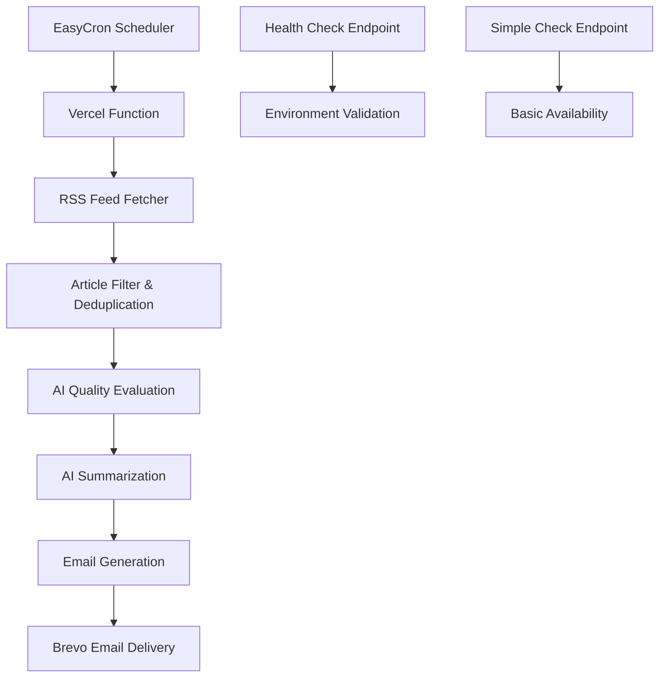

# ✨ AI News Automation ✨

<p align="center">
  
  
  
  
</p>

<p align="center">
  <strong>Your intelligent, automated daily briefing on the cutting-edge world of Artificial Intelligence</strong>
</p>

<p align="center">
  An advanced serverless system that intelligently curates, summarizes, and delivers the most important AI/tech news directly to your inbox every day.
</p>

---

## 📚 Table of Contents

- [🌟 Overview](#-overview)
- [✨ Key Features](#-key-features)
- [🏗️ Architecture](#️-architecture)
- [📁 Project Structure](#-project-structure)
- [🚀 Quick Start](#-quick-start)
- [🔑 API Keys Setup](#-api-keys-setup)
- [🚢 Deployment Guide](#-deployment-guide)
- [⏰ Automation Setup](#-automation-setup)
- [🔧 Usage & Testing](#-usage--testing)
- [🐛 Troubleshooting](#-troubleshooting)
- [📊 Performance](#-performance)
- [🤝 Contributing](#-contributing)

## 🌟 Overview

In the rapidly evolving world of AI, staying updated with the latest breakthroughs, research, and industry developments can be overwhelming. **AI News Automation** solves this by providing an intelligent, fully automated solution that:

- 🔍 **Scans 10+ premium AI/tech news sources** daily
- 🤖 **Uses Google Gemini AI** to evaluate and rank articles by importance
- ✍️ **Generates intelligent summaries** for the most valuable content
- 📧 **Delivers professional email briefings** with 10-15 top articles
- ⚡ **Completes the entire process** in under 200 seconds
- 🎯 **Focuses on the last 3 days** for maximum relevance

## ✨ Key Features

### 🧠 **Intelligent Article Curation**
- **Smart Source Selection**: Curates from MIT Technology Review, VentureBeat, MarkTechPost, Google Research, and 6+ other premium sources
- **AI Quality Evaluation**: Each article is rated 1-10 by Gemini AI for interest and knowledge value
- **Recency Filter**: Only processes articles from today, yesterday, and the day before yesterday
- **Duplicate Detection**: Advanced algorithms remove duplicate content based on title similarity

### 🤖 **Advanced AI Summarization**
- **Google Gemini 2.5 Pro Integration**: Creates comprehensive 4-5 sentence summaries
- **Context-Aware Processing**: Understands technical content and industry significance
- **Fallback System**: Generates detailed summaries even when AI processing fails
- **Quality Assurance**: Ensures all summaries meet minimum length and quality standards

### 📧 **Professional Email Delivery**
- **Responsive HTML Design**: Clean, mobile-friendly email templates
- **Source Attribution**: Clear crediting of original news sources
- **Performance Metrics**: Execution time and article count reporting
- **Reliable Delivery**: Uses Brevo (SendinBlue) for enterprise-grade email delivery

### 🚀 **Serverless & Scalable**
- **Vercel Deployment**: Zero-maintenance serverless architecture
- **5-Minute Timeout**: Optimized for complex AI processing workflows
- **Health Monitoring**: Built-in diagnostics and environment validation
- **Automated Scheduling**: EasyCron integration for reliable daily execution

## 🏗️ Architecture



**Data Flow:**
1. **Collection**: Fetch articles from 10+ RSS feeds (last 3 days)
2. **Evaluation**: AI rates each article 1-10 for interest/knowledge
3. **Selection**: Choose top 10-15 highest-rated articles
4. **Summarization**: Generate detailed AI summaries
5. **Delivery**: Send professional HTML email via Brevo

## 📁 Project Structure

```
ai-news-automation/
├── api/
│   ├── index.py        # 🚀 Main automation logic (RSS → AI → Email)
│   ├── check.py        # 🩺 Health check & environment validation
│   └── simple.py       # ✅ Basic availability endpoint
├── vercel.json         # ⚙️ Vercel deployment config (5-min timeout)
├── requirements.txt    # 📦 Python dependencies
├── .gitignore         # 🚫 Git ignore rules
├── WARP.md            # 🛠️ Development guidance
└── README.md          # 📖 This documentation
```

### File Descriptions:

- **`api/index.py`**: Core automation engine handling RSS fetching, AI processing, and email delivery
- **`api/check.py`**: Diagnostic endpoint for validating environment variables and configuration
- **`api/simple.py`**: Lightweight health check for basic service availability
- **`vercel.json`**: Configures 300-second timeout for AI processing workflows
- **`requirements.txt`**: Python dependencies including Gemini AI, feedparser, and Brevo SDK

## 🚀 Quick Start

### Prerequisites
- Python 3.9+ (for local development)
- GitHub account (for deployment)
- Google account (for Gemini API)
- Email address (for Brevo account)

### 1-Minute Setup
1. **Fork this repository** to your GitHub account
2. **Get your API keys** (detailed instructions below)
3. **Deploy to Vercel** with one click
4. **Set environment variables** in Vercel dashboard
5. **Configure EasyCron** for daily automation

## 🔑 API Keys Setup

### 🤖 Google Gemini API Key

1. **Visit Google AI Studio**: Go to [https://makersuite.google.com/app/apikey](https://makersuite.google.com/app/apikey)
2. **Sign in** with your Google account
3. **Create API Key**: Click "Create API Key" button
4. **Copy the key**: Save it securely (starts with `AIzaSy...`)

**Important Notes:**
- ✅ Free tier includes generous quotas for this project
- ✅ No credit card required for basic usage
- ⚠️ Keep your API key secure and never commit it to code

### 📧 Brevo (SendinBlue) API Key

1. **Sign up at Brevo**: Visit [https://www.brevo.com/](https://www.brevo.com/)
2. **Verify your email**: Complete the email verification process
3. **Access API Keys**: Go to Account → SMTP & API → API Keys
4. **Create new key**: Click "Generate a new API key"
5. **Copy the key**: Save it securely (starts with `xkeysib-...`)

**Email Setup Requirements:**
- ✅ **Sender Email**: Must be verified in your Brevo account
- ✅ **Domain Verification**: Recommended for better deliverability
- ✅ **Recipient Format**: Comma-separated list (e.g., `user1@email.com,user2@email.com`)

## 🚢 Deployment Guide

### Step 1: Fork Repository
1. Click the **"Fork"** button on this repository
2. Clone to your GitHub account

### Step 2: Deploy to Vercel
1. **Visit Vercel**: Go to [https://vercel.com/](https://vercel.com/)
2. **Sign up/Login**: Use your GitHub account
3. **Import Project**: Click "New Project" → Import from GitHub
4. **Select Repository**: Choose your forked repository
5. **Deploy**: Vercel will automatically detect the configuration

### Step 3: Configure Environment Variables
In your Vercel project dashboard:

1. Go to **Settings** → **Environment Variables**
2. Add the following variables:

| Variable Name | Description | Example Value |
|---------------|-------------|---------------|
| `GEMINI_API_KEY` | Google AI Studio API key | `AIzaSyC...` |
| `BREVO_API_KEY` | Brevo (SendinBlue) API key | `xkeysib-...` |
| `SENDER_EMAIL` | Verified sender email address | `news@yourdomain.com` |
| `RECIPIENT_EMAILS` | Comma-separated recipient list | `user1@email.com,user2@email.com` |

3. **Save** and **redeploy** the project

### Step 4: Verify Deployment
Visit your health check endpoint:
```
https://your-app-name.vercel.app/api/check
```

✅ **Success**: All variables show "✅ Set"  
❌ **Issues**: Follow the troubleshooting guide below

## ⏰ Automation Setup

### EasyCron Configuration

1. **Create Account**: Visit [https://www.easycron.com/](https://www.easycron.com/)
2. **Sign up** for a free account (supports 2 cron jobs)
3. **Create Cron Job**:
   - **URL**: `https://your-app-name.vercel.app/api/index`
   - **Schedule**: `29 18 * * *` (6:29 PM UTC / 11:59 PM IST daily)
   - **Name**: "AI News Daily Automation"
4. **Enable** the cron job
5. **Test**: Use "Execute Now" to verify it works

### Schedule Examples:
- `0 9 * * *` - 9:00 AM UTC daily
- `30 17 * * *` - 5:30 PM UTC daily  
- `0 0 * * 1` - Midnight UTC every Monday
- `29 18 * * *` - 6:29 PM UTC daily (recommended)

### Why EasyCron?
- ✅ **Free tier available** (2 cron jobs)
- ✅ **Reliable execution** with detailed logs
- ✅ **Web-based interface** for easy management
- ✅ **Better timeout handling** than alternatives
- ✅ **Execution history** and monitoring

## 🔧 Usage & Testing

### Manual Testing Endpoints

**Health Check** (Verify configuration):
```bash
curl https://your-app-name.vercel.app/api/check
```

**Manual Trigger** (Run automation now):
```bash
curl https://your-app-name.vercel.app/api/index
```

**Basic Availability** (Service status):
```bash
curl https://your-app-name.vercel.app/api/simple
```

### Expected Email Format

Your daily email will include:
- 📧 **Professional HTML design** with responsive layout
- 📰 **10-15 curated articles** from the last 3 days
- 🤖 **AI-generated summaries** (4-5 sentences each)
- 🏷️ **Source attribution** and publication dates
- 🔗 **Direct links** to full articles
- ⏱️ **Performance metrics** (execution time, article count)

### Success Indicators

✅ **Successful execution**:
- Health check shows all variables set
- Manual trigger returns success message
- Email delivered within 200 seconds
- EasyCron shows successful execution

## 🐛 Troubleshooting

### Environment Variable Issues

**Problem**: Health check shows "❌ Missing" variables
**Solution**: 
1. Verify variables are set in Vercel dashboard
2. Check for typos in variable names
3. Redeploy after adding variables
4. Ensure no extra spaces in values

### Email Delivery Problems

**Problem**: No emails received
**Solutions**:
1. **Check Brevo account**: Verify sender email is confirmed
2. **Check spam folder**: Emails might be filtered
3. **Verify API key**: Ensure Brevo API key is valid
4. **Check recipient format**: Use comma-separated emails without spaces
5. **Review Brevo logs**: Check delivery status in Brevo dashboard

### RSS Feed Failures

**Problem**: "No articles found" message
**Solutions**:
1. **Check internet connectivity**: Ensure Vercel can access RSS feeds
2. **Verify feed URLs**: Some feeds may have changed
3. **Check date filtering**: Articles might be older than 3 days
4. **Review Vercel logs**: Look for specific feed errors

### AI Summarization Errors

**Problem**: Articles show basic summaries instead of AI summaries
**Solutions**:
1. **Verify Gemini API key**: Check Google AI Studio dashboard
2. **Check API quotas**: Ensure you haven't exceeded limits
3. **Review rate limiting**: AI requests are automatically throttled
4. **Fallback system**: Basic summaries are used when AI fails (this is normal)

### Timeout Issues

**Problem**: EasyCron shows timeout errors
**Solutions**:
1. **Check email delivery**: If email arrives, the function succeeded
2. **Review execution time**: Target is <200 seconds
3. **Vercel function logs**: Check for actual errors vs. HTTP timeouts
4. **Increase EasyCron timeout**: Set to 300+ seconds in EasyCron settings

### Performance Issues

**Problem**: Execution takes longer than 200 seconds
**Solutions**:
1. **Reduce RSS feeds**: Modify the feed list in `api/index.py`
2. **Decrease article count**: Lower the evaluation limit
3. **Optimize AI calls**: Reduce delay between requests
4. **Check Vercel logs**: Identify bottlenecks in processing

## 📊 Performance

### Benchmarks
- ⚡ **Target Execution Time**: <200 seconds
- 📰 **Articles Processed**: 10-15 high-quality articles
- 🔍 **Sources Scanned**: 10+ premium RSS feeds
- 📅 **Content Freshness**: Last 3 days only
- 🤖 **AI Processing**: ~2-3 seconds per article
- 📧 **Email Delivery**: <5 seconds via Brevo

### Optimization Features
- **Smart Timeouts**: 4-second RSS feed timeouts
- **Parallel Processing**: Concurrent feed fetching
- **Rate Limiting**: Controlled AI API calls
- **Early Termination**: Stops when enough articles found
- **Efficient Filtering**: Quick duplicate detection

## 🤝 Contributing

We welcome contributions to improve the AI News Automation system!

### How to Contribute
1. **Fork** the repository
2. **Create a feature branch**: `git checkout -b feature/amazing-feature`
3. **Make your changes**: Improve code, documentation, or features
4. **Test thoroughly**: Ensure all functionality works
5. **Commit changes**: `git commit -m 'Add amazing feature'`
6. **Push to branch**: `git push origin feature/amazing-feature`
7. **Open Pull Request**: Submit for review

### Development Guidelines
- Follow Python PEP 8 style guidelines
- Add comments for complex logic
- Test changes with manual triggers
- Update documentation for new features
- Ensure backward compatibility

### Ideas for Contributions
- 🔍 **New RSS Sources**: Add more AI/tech news feeds
- 🎨 **Email Templates**: Improve HTML design
- 📊 **Analytics**: Add usage statistics
- 🔧 **Configuration**: More customization options
- 🌐 **Internationalization**: Multi-language support

---

<p align="center">
  <strong>Built with ❤️ for the AI community</strong><br>
  <em>Stay informed, stay ahead</em>
</p>

<p align="center">
  <a href="#-table-of-contents">Back to Top</a>
</p>
